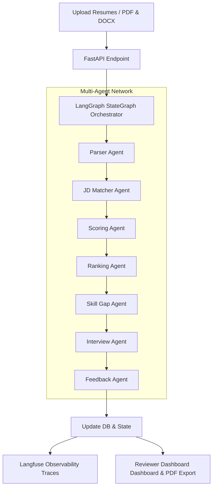

# Multi-Agent Resume Screening & Interview Preparation System

An enterprise-grade, multi-agent AI recruitment platform that automates candidate resume screening, evaluates skills alignment, calculates detailed score metrics, logs execution traces using Langfuse, and provides a reviewer dashboard with PDF report card exports.

---

## System Architecture



---

## Folder Structure

```
resume-screening-system/
├── Dockerfile                  # unified/base builds
├── docker-compose.yml          # Compose orchestration
├── requirements.txt            # Python dependencies
├── pyproject.toml              # python tool settings
├── .env.example                # Template configuration
├── README.md                   # System documentation
├── backend/                    # FastAPI python services
│   ├── main.py                 # API app entrypoint
│   ├── config.py               # Env settings
│   ├── api/                    # API routing endpoints
│   ├── agents/                 # Multi-Agent logic nodes
│   ├── prompts/                # Prompts templates
│   ├── tools/                  # Resume parser utils
│   ├── state/                  # Shared TypedDict graph state
│   ├── database/               # JSON file DB adapter
│   ├── models/                 # Validation schemas
│   └── services/               # LangGraph compilation service
├── frontend/                   # Vite React app
│   └── src/
│       ├── main.jsx            # React root mount
│       ├── App.jsx             # Router definition
│       ├── index.css           # Tailwind configurations
│       ├── components/         # Reusable widgets
│       ├── pages/              # View pages
│       └── layouts/            # Sidebar layouts
├── tests/                      # Automated test suite
├── data/                       # Local volume uploads and DB
└── mlops/                      # Simulation evaluations scripts
```

---

## Installation & Running

### Option 1: Using Docker (One Command)

1. Ensure Docker is running.
2. Initialize the project:
   ```bash
   docker-compose up --build
   ```
3. Open the frontend dashboard at `http://localhost`.

### Option 2: Running Locally (Manual Development)

#### 1. Setup the Backend
1. Navigate to the root directory and create a virtual environment:
   ```bash
   python -m venv venv
   source venv/bin/activate  # Or `venv\Scripts\activate` on Windows
   ```
2. Install Python packages:
   ```bash
   pip install -r requirements.txt
   ```
3. Copy `.env.example` to `.env` and fill in credentials:
   ```bash
   cp .env.example .env
   ```
   For LLM extraction/scoring, set `GROQ_API_KEY=...`. If the key is missing or Groq fails, the app uses the built-in heuristic/mock fallback responses.
4. Run FastAPI using Uvicorn:
   ```bash
   uvicorn backend.main:app --reload --port 8000
   ```

#### 2. Setup the Frontend
1. Open a new terminal and navigate to the `frontend/` directory.
2. Install dependencies:
   ```bash
   npm install
   ```
3. Start the Vite React development server:
   ```bash
   npm run dev
   ```
4. Open the interface at `http://localhost:3000`.

---

## Preseeded Login Credentials
During development, the database initializes with these login credentials:
* **Admin**: `admin` / `admin123`
* **HR**: `hr` / `hr123`
* **Reviewer**: `reviewer` / `reviewer123`
